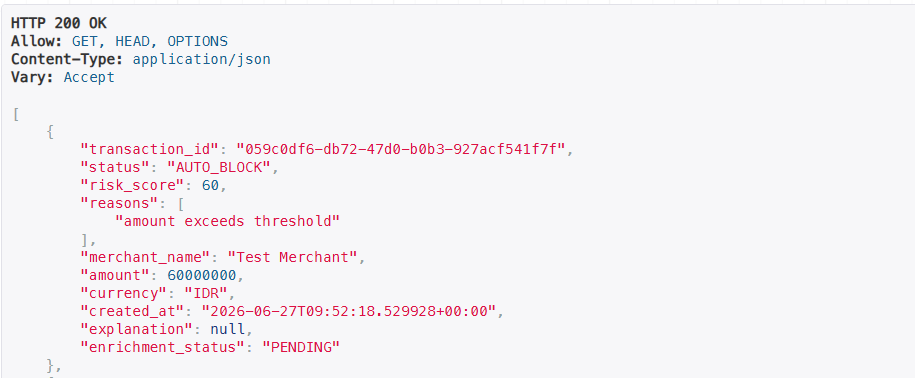
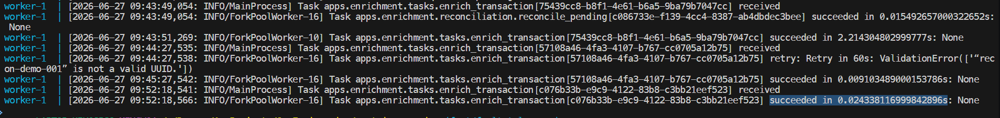
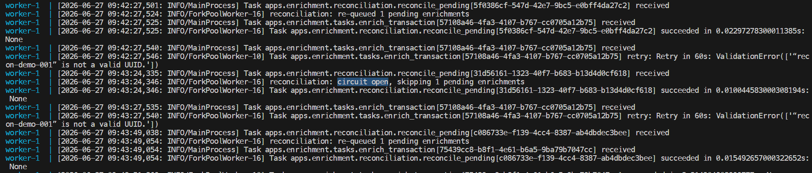
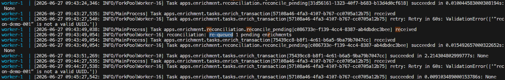

# py-triage-engine

A Django REST API that receives payment webhook events and screens each
transaction through a deterministic rule engine, returning one of three
outcomes: AUTO_APPROVE, NEEDS_REVIEW, or AUTO_BLOCK. Flagged transactions
are enriched asynchronously with an LLM-generated explanation for human
reviewers.

## Why This Project

Built to learn Django and DRF end-to-end by solving a concrete problem.
The goal was to get the rule engine and synchronous request cycle right
before adding any moving parts.

That worked until load testing revealed what happens when a slow
external call sits on the request thread. Under 500 concurrent users,
87.9% of requests failed. The fix was not to make the call faster; it
was to move it off the request thread entirely. That introduced async
enrichment — which introduced its own failure modes: blind retries
against a throttled dependency, and no way to see inside the pipeline
when something went wrong.

## Architecture

Request flow with layered separation:
- View — HTTP handler, validates request, returns 202 immediately
- Service — rule engine evaluation, idempotency check, enqueue logic
- Task — Celery async worker, LLM call, enrichment persistence
- Repository — PostgreSQL via Django ORM, MongoDB via pymongo

## Tech Stack

Python 3.12 · Django 5 · Django REST Framework · Celery · Redis · PostgreSQL · MongoDB · Docker · Docker Compose

## What's Implemented

- `POST /api/webhook/` — rule engine screens each transaction; returns 202 immediately
- Rule engine: AmountRule, FrequencyRule, GeoMismatchRule; deterministic score routing
- Idempotency guard with select_for_update; duplicate webhooks blocked at DB level
- Celery async worker decouples LLM enrichment from request thread; enrichment state machine: QUEUED; PROCESSING; COMPLETED; FAILED; PENDING
- Redis-backed circuit breaker with HALF-OPEN trial lock; graceful degradation to PENDING when circuit open
- Reconciliation job via Celery beat; re-queues stale PENDING enrichments when circuit closed
- Polyglot persistence: PostgreSQL for transactions; MongoDB for enrichment documents; joined at application layer

## Engineering Decisions

| Failure Mode | Without Fix | Solution |
|---|---|---|
| LLM call blocks request thread | 87.9% errors under 500 concurrent users | Celery async worker; API returns 202 immediately |
| Same webhook delivered twice | Duplicate MongoDB enrichment documents | select_for_update on enrichment_queued flag; second enqueue blocked at DB level |
| Celery retries exhausted silently | Transaction stays QUEUED forever | Catch retry exhaustion explicitly; write FAILED status to MongoDB |
| Enrichment schema varies per transaction type | Nullable columns or multiple tables in relational DB | MongoDB document store; flexible schema per enrichment document |
| LLM returns free-form text | Unparseable by downstream systems | System prompt constrains output to structured JSON with defined fields |
| LLM dependency throttled or down | Blind retry storm; worker queue backs up | Circuit breaker opens after N failures; fail-fast returns PENDING |
| Circuit OPEN leaves PENDING enrichments permanently | Dashboard shows stale state indefinitely | Reconciliation job re-queues PENDING when circuit CLOSED; eventual completeness |
| Multiple workers race on HALF-OPEN trial | Two workers both attempt trial LLM call | Redis SET NX EX trial lock; only one worker proceeds |

## Enrichment Output

LLM explanation is stored as structured JSON, not free-form text:

```json
{
  "summary": "Large transaction with a suspicious merchant in Bali.",
  "risk_factors": ["amount exceeds threshold", "suspicious merchant"],
  "recommended_action": "Block the transaction and investigate further.",
  "confidence": "high"
}
```

<details>
<summary>Dashboard response — enrichment COMPLETED</summary>


</details>

<details>
<summary>Dashboard response — enrichment PENDING (circuit open)</summary>



</details>

## Load Test — Synchronous Path (before fix)

Simulated a slow external call (2s latency) on the request thread to
measure behavior under concurrent load. 500 concurrent users, 50/s ramp.

| Metric | Result |
|---|---|
| Total requests | 2,742 |
| Failures | 2,409 (87.9%) |
| Avg latency | 20,334ms |
| Median latency | 27,000ms |
| 99th percentile | 37,000ms |
| RPS | 17.1 |

Key finding: a 2-second blocking call on the request thread causes
87.9% of requests to fail under 500 concurrent users. Thread pool
exhaustion means most requests never reach the rule engine.

<details>
<summary>Locust screenshot</summary>


</details>

## Real-World Behavior — OpenRouter Rate Limiting

Under concurrent load, the free-tier LLM API returned 429 Too Many
Requests. The worker retried with 60s backoff but continued hitting
the rate limit. This is the behavior that motivated the circuit breaker:
instead of blind retrying against a throttled dependency, detect the
failure pattern and stop hammering it.

<details>
<summary>Worker log — 429 retry loop</summary>


</details>

<details>
<summary>Worker log — successful enrichment</summary>


</details>

## Circuit Breaker Behavior

When the circuit opens, the worker skips the LLM call entirely.
Task completes in ~0.03s instead of 2-4s. Enrichment status is
set to PENDING. The rule engine verdict is unaffected.
When the circuit closes, the reconciliation job re-queues
stale PENDING enrichments automatically.

<details>
<summary>Worker log — circuit open, LLM call skipped</summary>



</details>

<details>
<summary>Worker log — reconciliation skipped (circuit open)</summary>



</details>

<details>
<summary>Worker log — reconciliation re-queued pending enrichments</summary>



</details>

## Run Locally

```bash
docker compose up --build

cp .env.example .env
# fill in OPENROUTER_API_KEY and OPENROUTER_MODEL in .env

python -m pytest apps/ -v
```